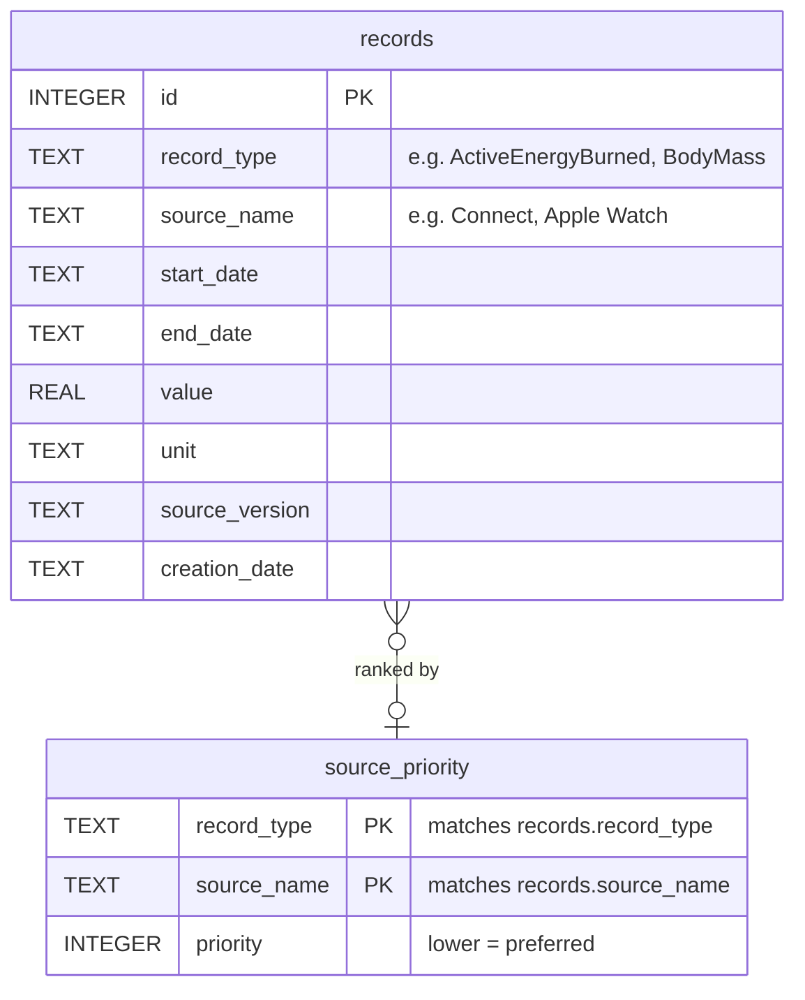

# health_db

Quick repo to run analyses over data collected with Apple Health. Uses an SQLite database to manage the data after import.

- [health\_db](#health_db)
  - [Layout](#layout)
  - [Schema](#schema)
  - [Setup](#setup)
  - [Ingesting an export](#ingesting-an-export)

## Layout

```txt
src/    Python code
sql/    SQL code
data/
  raw/  Place export.xml here (the file Apple Health produces)
  db/   SQLite database location
```

## Schema

Two base tables and a layered set of views. `records` holds every quantity-shape sample (energy, weight, etc.); `source_priority` declares which source wins on days that have multiple.



Views compose top-down:

```txt
records
  └─ records_canonical              (filters to preferred source per type+day)
       ├─ active_energy_canonical   (record_type = 'ActiveEnergyBurned')
       │    └─ daily_active_energy_canonical   (SUM value per day -> kcal)
       └─ body_mass_canonical       (record_type = 'BodyMass')
            └─ daily_body_mass_canonical       (AVG value per day -> kg)
```

Analysis scripts should query the `daily_<type>_canonical` views rather than re-deriving the priority/rollup logic.

## Setup

Environment requirements are in `pyproject.toml`.

To enable the local schema/README drift check on every commit:

```bash
pipx install pre-commit  # or: pip install pre-commit
pre-commit install
```

The same check runs in GitHub Actions on push and pull request (see `.github/workflows/checks.yml`).

## Ingesting an export

Place the unzipped `export.xml` from Apple Health into `data/raw/`, then generate the SQLite database with

```bash
python src/parse_apple_health.py data/raw/export.xml data/db/health.db
```

Re-running the parser does not duplicate rows.
